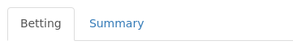
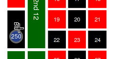
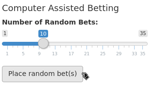
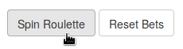
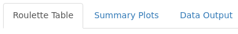
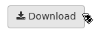

# americanRoulette - R Shiny Implementation
`americanRoulette` is a R Shiny implementation of the American Roulette, the popular casino game. The loaded and running applet can be tried at [ignatkulinka.shinyapps.io/AmericanRoulette/](http://ignatkulinka.shinyapps.io/AmericanRoulette/).

## Quick Start
To download and launch `americanRoulette` you need to download and install `devtools` as well as the application itself. To do that use the R Studio console and type in the following code:

    install.packages("devtools")    # install devtools
    devtools::install_github("ignatkulinka/americanRoulette")    #install americanRoulette
    library(americanRoulette)    # import the americanRoulette app
    americanRoulette::launch()    # launch the app!

---

## Package Requirements 
`americanRoulette` uses functions/methods from packages DT, shiny, ggplot2 and stringr. These can be installed using the following line:
    
    install.packages("PACKAGE NAME HERE")

## App Mechanics
* **NEW**: Multiple sessions are now allowed! Join others playing on the hosted app or run multiple sessions on your machine/local server. On your local server/machine open multiple windows in your web browser or use R Studio built-in browser as one of the sessions.

`americanRoulette` is divided into parts by tabs on the left and right sides of the screen.

### The left hand side tabs:

#### Betting

* **Manual Betting**: allows for a user to enter bets. Here the user can manually select a bet amount and then click on the roulette table to place a bet. To select the bet amount click the button with the corresponding dollar amount. The bets can be stacked by clicking the betting spot again to increase bet amount. 
* **NEW**: additionally, the user is allowed to choose the color of the betting chips with the convenient color selector drop-down menu on the left hand side.  

   
   
  <i><b>^Placing $250 on Black &nbsp;&nbsp;&nbsp; ^Placing ten random bets</b></i>

* **Computer Assisted Betting**: another way to bet is to use the random bet generator. First, use the slider to set the number of bets you want to generate and then click the _**place random bet**_ button to automatically add the bets to the roulette table. 

#### Summary
Provides a list overview of the bets that a user has placed. The bets are divided into two tables: Manual and CPU bets. The Reset button allows for the user to clear the table of any bets. In addition, this tab has the _**spin the roulette**_ button. This button will generate a random winning slot and output it. Lastly, the Results table will show the user which of the bets won and lost.  

    
    
   <i><b>^spin the roulette and reset buttons</b></i>

### The right hand side tabs:

#### Roulette Table
This tab outputs a simulation of the American roulette table. This plot can be clicked to place bets. The clickable spots follow the general official rules for betting. Bets can be stacked on top of each other by clicking them again.

#### Summary Plots
This tab provides a useful insight into the statistics behind the current game session. Monitor the amount of money won/lost, number of bets won, frequency of winning slots and many more. 

#### Data Output
**Warning**: Data download option only functions when the app is open in web browser. At the moment, downloading data from the built-in R Studio browser is not possible.

This tab shows the running list of all the possibly useful data that is being generated by the simulation. By clicking this tab, the user can take a quick look at the data or click the Download button to download a .csv copy of the table.

   
   
  <i><b>^download the data button</b></i>

